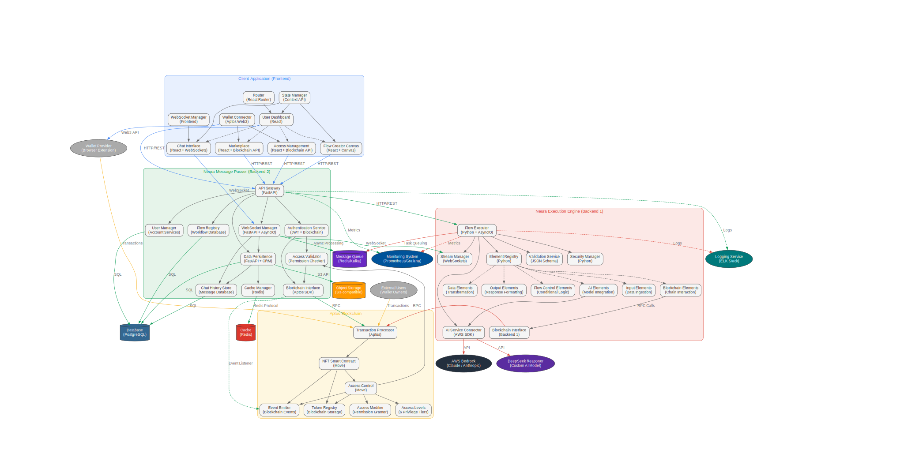

- [NeuraLabs: A Blockchain-Based Platform for AI Flow Ownership and Execution](#neuralabs-a-blockchain-based-platform-for-ai-flow-ownership-and-execution)
  - [Abstract](#abstract)
  - [1. Introduction](#1-introduction)
  - [2. System Architecture Overview](#2-system-architecture-overview)
    - [2.1 High-Level Architecture](#21-high-level-architecture)
    - [2.2 Role of Blockchain in the System](#22-role-of-blockchain-in-the-system)
  - [3. Technical Components](#3-technical-components)
    - [3.1 Neura Execution Engine (Backend 1)](#31-neura-execution-engine-backend-1)
      - [3.1.1 Core Functionality](#311-core-functionality)
      - [3.1.2 Component Structure](#312-component-structure)
      - [3.1.3 Execution Model](#313-execution-model)
    - [3.2 Neura Message Passer (Backend 2)](#32-neura-message-passer-backend-2)
      - [3.2.1 Core Functionality](#321-core-functionality)
      - [3.2.2 Data Management](#322-data-management)
      - [3.2.3 Communication Protocols](#323-communication-protocols)
    - [3.3 Client Application (Frontend)](#33-client-application-frontend)
      - [3.3.1 Core Components](#331-core-components)
      - [3.3.2 Technical Implementation](#332-technical-implementation)
    - [3.4 Smart Contract Implementation](#34-smart-contract-implementation)
      - [3.4.1 Contract Structure](#341-contract-structure)
      - [3.4.2 Access Levels](#342-access-levels)
  - [4. Communication and Networking](#4-communication-and-networking)
    - [4.1 WebSocket Implementation](#41-websocket-implementation)
    - [4.2 Data Flow Architecture](#42-data-flow-architecture)
      - [4.2.1 Execution Flow](#421-execution-flow)
      - [4.2.2 Access Control Flow](#422-access-control-flow)
    - [4.3 Real-time Update Mechanism](#43-real-time-update-mechanism)
  - [5. Data Storage and Management](#5-data-storage-and-management)
    - [5.1 On-chain Data](#51-on-chain-data)
    - [5.2 Off-chain Data](#52-off-chain-data)
    - [5.3 Data Synchronization](#53-data-synchronization)
  - [6. User Interfaces and Components](#6-user-interfaces-and-components)
    - [6.1 Flow Creator Canvas](#61-flow-creator-canvas)
    - [6.2 Chat Interface](#62-chat-interface)
    - [6.3 Access Management Portal](#63-access-management-portal)
    - [6.4 Marketplace](#64-marketplace)
  - [7. Execution Model](#7-execution-model)
    - [7.1 Flow Compilation](#71-flow-compilation)
    - [7.2 Execution Permissions](#72-execution-permissions)
    - [7.3 Binary Compilation Roadmap](#73-binary-compilation-roadmap)
  - [8. Security and Access Control](#8-security-and-access-control)
    - [8.1 NFT Access Level Implementation](#81-nft-access-level-implementation)
    - [8.2 Security Architecture](#82-security-architecture)
    - [8.3 Permission Verification Flow](#83-permission-verification-flow)
  - [9. Future Work and Extensions](#9-future-work-and-extensions)
    - [9.1 Technical Extensions](#91-technical-extensions)
    - [9.2 Ecosystem Development](#92-ecosystem-development)
    - [9.3 Business Model Evolution](#93-business-model-evolution)
  - [10. Conclusion](#10-conclusion)
  - [References](#references)


# NeuraLabs: A Blockchain-Based Platform for AI Flow Ownership and Execution

## Abstract

This paper presents NeuraLabs, a novel platform that combines artificial intelligence (AI) workflows with blockchain technology to create an ecosystem where AI processes can be owned, traded, and executed as non-fungible tokens (NFTs). The platform introduces a granular access control system with six distinct levels of ownership, enabling unprecedented flexibility in how AI workflows can be shared, monetized, and utilized. 

The system architecture consists of three primary components: the Neura Execution Engine (Backend 1), the Neura Message Passer (Backend 2), and the Client Application (Frontend), all working in concert with the Aptos blockchain. This paper details the technical implementation of these components, their interactions, data flow, storage mechanisms, and the role that blockchain technology plays in preserving intellectual property rights while fostering an open marketplace for AI workflows.

The NeuraLabs platform represents a significant advancement in the intersection of artificial intelligence and distributed ledger technologies, creating new paradigms for intellectual property management in the rapidly evolving AI landscape. By tokenizing AI workflows and implementing granular access controls, the platform addresses key challenges in attribution, compensation, and rights management while enabling new business models for AI innovation.

## 1. Introduction

The convergence of artificial intelligence and blockchain technology has created new opportunities for addressing ownership, attribution, and monetization of AI-generated content and workflows. As AI capabilities continue to advance, questions of who owns the processes, models, and outputs have become increasingly complex. Traditional intellectual property frameworks struggle to accommodate the collaborative, iterative nature of AI development and the ease with which digital assets can be replicated.

NeuraLabs addresses these challenges by leveraging blockchain technology to create a transparent, secure system for managing ownership and access to AI workflows. By representing workflows as non-fungible tokens (NFTs) on the Aptos blockchain, the platform establishes clear provenance and enables fine-grained control over how workflows can be used, modified, and shared.

The key innovations of the NeuraLabs platform include:

1. **Tokenization of AI workflows as NFTs with customizable access levels**: The platform transforms AI processes from abstract concepts into distinct digital assets with verifiable ownership and transferable rights.

2. **A distributed execution architecture that maintains ownership rights**: The separation between the execution environment and access control systems ensures that intellectual property protections remain intact during workflow usage.

3. **Real-time communication between components via WebSockets**: A sophisticated networking layer enables seamless, responsive interactions between the user interface, coordination layer, and execution environment.

4. **A visual canvas for workflow creation and modification**: An intuitive graphical interface allows users to create complex AI workflows without requiring deep programming knowledge, democratizing access to AI capabilities.

5. **A marketplace for trading AI workflow access rights**: A blockchain-based exchange system facilitates the discovery, evaluation, and secure transfer of workflow access rights, creating economic opportunities for AI developers.

6. **Decentralized access management using blockchain technology**: By moving access control to a blockchain, the system ensures that rights management remains transparent, immutable, and resistant to unauthorized modifications.

This platform addresses the growing need for clear ownership attribution in AI-generated assets while creating new economic opportunities for AI developers and users. By providing a structured framework for managing intellectual property rights in AI workflows, NeuraLabs helps bridge the gap between traditional legal frameworks and the rapidly evolving technical capabilities of artificial intelligence systems.

In the following sections, we provide a detailed examination of the system architecture, technical components, communication protocols, data management approaches, and user interfaces that comprise the NeuraLabs platform.

## 2. System Architecture Overview

### 2.1 High-Level Architecture

The NeuraLabs platform employs a distributed, multi-tier architecture designed to separate concerns while maintaining secure, efficient communication between components. This separation enhances security, scalability, and flexibility, allowing each component to evolve independently while preserving interoperability through well-defined interfaces.

The platform consists of three primary components:

1. **Neura Execution Engine (Backend 1)**: This component forms the computational core of the platform, responsible for executing AI workflow graphs, managing connections to AI models, and streaming execution results. Built with Python and FastAPI, the Execution Engine implements a sophisticated dependency resolution system that ensures workflows execute correctly regardless of complexity. It connects to external AI services such as AWS Bedrock for model inference capabilities while maintaining a separation between execution logic and access control.

2. **Neura Message Passer (Backend 2)**: Serving as the central coordinator of the system, the Message Passer mediates between the frontend client, blockchain, and execution engine. It handles critical functions including data persistence, access control verification, authentication, and message routing. This component ensures that execution requests are only forwarded to the Execution Engine when the requesting user has appropriate permissions, creating a security boundary that protects intellectual property rights.

3. **Client Application (Frontend)**: The Client Application provides the user-facing interfaces for workflow creation, execution, marketplace interactions, and access management. Implemented as a responsive web application, it communicates with the Message Passer via WebSockets for real-time updates and RESTful APIs for standard operations. The Client Application includes specialized interfaces for different user activities, from visual workflow design to conversational interaction with deployed workflows.

These components work together in a carefully orchestrated manner, with well-defined communication protocols and data flows. The architecture implements multiple layers of validation and security to ensure that access controls are consistently enforced throughout the system.

Figure 1 illustrates the high-level architecture and interactions between these components:

```
[Client Application] <--WebSocket--> [Neura Message Passer] <--WebSocket--> [Neura Execution Engine]
        ^                                    ^
        |                                    |
        v                                    v
[Flow Creator Canvas]                [Aptos Blockchain]
[Chat Interface]                     [NFT Smart Contract]
[Access Management]
[Marketplace]
```

The bidirectional arrows represent real-time communication channels that enable immediate updates and responsive interactions. Each component maintains a clear separation of responsibilities while working in concert to provide a seamless user experience.


<!-- add image here using html tag -->




### 2.2 Role of Blockchain in the System

The Aptos blockchain forms the cryptographic foundation of the NeuraLabs ecosystem, providing immutable, transparent record-keeping and decentralized execution of access control logic. By leveraging blockchain technology, the platform creates a trustless environment where rights can be verified and enforced without requiring centralized authorities or manual oversight.

The Aptos blockchain serves several critical functions within the NeuraLabs ecosystem:

1. **Ownership Registry**: The blockchain maintains an authoritative record of which users own which AI workflow NFTs. This ownership registry cannot be altered except through cryptographically signed transactions from the current owner, ensuring that ownership claims remain secure and verifiable. The Move-based smart contract implements a resource-oriented approach to represent workflow ownership, aligning with Aptos's resource-focused programming model.

2. **Access Control**: Beyond simple ownership, the blockchain manages the granular access permissions for each workflow. The smart contract implements sophisticated logic for tracking which users have been granted which access levels, including default access levels for users not explicitly listed. This on-chain access control system ensures that permission rules cannot be circumvented or modified by unauthorized parties.

3. **Rights Management**: The blockchain enforces the specific rights granted to users based on their access levels. The smart contract includes functions to verify whether a user has sufficient access rights for a requested operation, providing a cryptographically secure boundary for rights enforcement. This rights management system translates the abstract concept of "level of ownership" into concrete, enforceable rules.

4. **Transaction History**: The blockchain provides an immutable record of all ownership transfers, access grants, and permission modifications. This comprehensive history creates transparency in how rights have evolved over time and provides an audit trail that can help resolve disputes or verify compliance with agreements. Each transaction is timestamped and cryptographically linked to previous transactions, creating an unalterable chain of provenance.

5. **Marketplace Facilitation**: The blockchain enables secure trading of workflow access rights through smart contract functions for listing, purchasing, and transferring NFTs and associated permissions. The decentralized nature of the blockchain ensures that marketplace transactions execute exactly as specified, without requiring trust between the parties involved. The smart contract includes escrow functionality to ensure atomic execution of trades, protecting both buyers and sellers.

The blockchain ensures that access to AI workflows is cryptographically secure, transparently tracked, and properly compensated. By moving the ownership and access control to the blockchain, the system can operate in a trustless manner where even the operators of the execution engine cannot violate the access rights of workflow creators. This creates a foundation for a sustainable ecosystem where intellectual property rights are protected while enabling flexible sharing and monetization models.

The choice of Aptos as the blockchain platform leverages its high-performance Move virtual machine, parallel execution capabilities, and resource-oriented programming model. These features make it particularly well-suited for managing the complex ownership and access patterns required for AI workflow NFTs.

## 3. Technical Components

### 3.1 Neura Execution Engine (Backend 1)

The Neura Execution Engine represents the computational heart of the NeuraLabs platform, responsible for the actual execution of AI workflows. Implemented in Python using FastAPI for its asynchronous capabilities, this component manages the directed graph of execution elements that comprise each workflow. The Execution Engine operates as a stateless service that processes workflow definitions, resolves dependencies, and ensures proper data flow between components.

#### 3.1.1 Core Functionality

The Execution Engine provides a comprehensive set of capabilities for workflow execution:

1. **Flow Execution**: The engine processes the directed graph of a workflow, analyzing the dependencies between elements and executing them in the correct order. It implements sophisticated algorithms for traversing the graph, handling both linear sequences and branching paths based on conditional logic. The execution system supports both forward flow (normal execution) and backtracking (resolving dependencies) to ensure all elements receive the inputs they require.

2. **AI Model Integration**: A key function of the Execution Engine is connecting to external AI services for model inference. It implements adapters for services like AWS Bedrock, allowing workflows to incorporate state-of-the-art AI models like Claude for text generation and analysis. The engine handles the complexities of API authentication, request formatting, and response parsing, presenting a unified interface to the workflow elements regardless of the underlying AI service.

3. **Blockchain Interaction**: When necessary, the Execution Engine can read and write data to the blockchain, although most blockchain interactions are mediated through the Message Passer. This capability allows the engine to verify access rights directly when executing sensitive operations and to record execution metrics or results that should be permanently stored.

4. **Real-time Streaming**: Throughout the execution process, the engine streams detailed events and results via WebSockets. This streaming approach enables real-time monitoring of execution progress, immediate delivery of partial results, and interactive experiences like chat interfaces. The streaming system implements buffering, reconnection logic, and backpressure handling to ensure reliable delivery even under variable network conditions.

The Execution Engine is designed with security and scalability as primary considerations. It implements sandbox isolation for workflow execution, preventing malicious or poorly designed workflows from affecting other users or the system itself.

#### 3.1.2 Component Structure

The Execution Engine implements a modular architecture with well-defined components:

- **ElementBase Class**: This abstract base class defines the interface and common functionality for all flow elements. It implements the core methods for input/output management, connection handling, and execution control. All specific element types inherit from this base class, ensuring consistent behavior across the system. The ElementBase class includes methods for validating inputs and outputs against schema definitions, ensuring type safety throughout the execution process.

- **FlowExecutor**: This orchestration component manages the execution of elements in the correct order based on their dependencies. It implements a sophisticated algorithm that combines topological sorting with dynamic dependency resolution to handle complex workflow structures. The FlowExecutor maintains a cache of execution results to avoid redundant computation when elements are used by multiple downstream components.

- **StreamManager**: This component handles the streaming of execution events and results to listeners via WebSockets. It implements different streaming strategies based on the listener type, supporting both Backend 2 connectivity and direct client connections. The StreamManager includes mechanisms for handling connection disruptions, ensuring message delivery even when temporary network issues occur.

- **ServiceIntegrations**: These specialized components connect to external services like AWS Bedrock for AI model inference and the Aptos blockchain for data verification or recording. Each integration implements retry logic, error handling, and response transformation to present a consistent interface to the workflow elements regardless of the peculiarities of the external service.

- **Flow Control Elements**: These specialized elements manage the execution flow path based on conditions. They include components for branching, merging parallel paths, and selecting between alternative execution routes. Flow control elements enable workflows to implement sophisticated logic like if-then-else structures, loops, and dynamic path selection based on intermediate results.

The Execution Engine also implements a rich library of element types for different functions:

1. Input elements for receiving user data and context
2. Processing elements for data transformation and analysis
3. AI elements for leveraging machine learning models
4. Output elements for formatting and returning results
5. Integration elements for connecting to external systems
6. Utility elements for common operations like filtering and merging

This comprehensive element library allows workflow creators to build sophisticated AI processes without requiring custom coding for common operations.

#### 3.1.3 Execution Model

The execution follows a dependency-resolved graph traversal algorithm that ensures all elements receive their required inputs before execution:

1. The executor begins at the designated start element, which typically has no inputs or receives inputs from the initial request.

2. For each element in the flow:
   - The executor checks if all dependencies (upstream elements that provide inputs) have been executed
   - If dependencies are not yet executed, the executor backtracks to execute them first
   - Once all dependencies are resolved, the element is executed with its inputs
   - The outputs of the element are cached in the executor's output store
   - These outputs are made available to downstream elements
   - Execution events and results are streamed in real-time to listeners

3. The `downwards_execute` flag controls whether execution should continue to downstream elements. This flag allows conditional execution paths where certain branches may be skipped based on runtime conditions, implementing if-then-else type logic in the workflow.

4. The backtracking mechanism ensures that even if dependencies are encountered out of order, they will be executed when needed. This allows workflow creators to focus on the logical flow of data rather than the specific execution order.

The execution model also implements sophisticated error handling:

1. Element-level errors are captured and can be handled by the workflow itself
2. Execution can continue along alternative paths if an element fails
3. Detailed error information is streamed to facilitate debugging
4. The executor can implement retry policies for transient failures

This robust execution model enables workflows of arbitrary complexity while ensuring reliable, predictable behavior even in the face of errors or unusual flow patterns.

### 3.2 Neura Message Passer (Backend 2)

The Neura Message Passer serves as the central coordinator for the entire system, managing communication between the client application, the blockchain, and the execution engine. This critical middleware component handles authentication, access control verification, data persistence, and message routing, ensuring that all interactions comply with the established permissions and maintain system integrity.

#### 3.2.1 Core Functionality

The Message Passer provides a comprehensive set of services that form the backbone of the NeuraLabs platform:

1. **Authentication and Authorization**: The Message Passer verifies user identity through secure authentication mechanisms and validates access rights for specific workflows. It implements a multi-layered authorization approach that combines blockchain-based verification with performance-optimized caching. This component translates blockchain-recorded ownership and access rights into operational permissions for specific actions, providing a bridge between the cryptographic guarantees of the blockchain and the practical needs of a responsive application.

2. **Data Persistence**: One of the Message Passer's primary responsibilities is storing and managing the various data assets of the platform. It implements structured storage for flow definitions, execution results, and chat history. This persistence layer ensures that workflows and their outputs remain available even when not actively executing, creating continuity across user sessions. The storage system implements appropriate backup, encryption, and access control mechanisms to protect sensitive data.

3. **Access Control Enforcement**: Before any operation is performed, the Message Passer verifies that the requesting user has sufficient access rights. It queries the blockchain for current access levels and compares them against the requirements of the requested operation. This enforcement creates a security boundary that prevents unauthorized access to workflows or their execution capabilities, protecting the intellectual property rights established through the NFT system.

4. **WebSocket Management**: The Message Passer maintains persistent WebSocket connections between the client application and the execution engine. It handles connection establishment, heartbeat monitoring, reconnection logic, and message routing. These persistent connections enable real-time updates and responsive interaction, creating a seamless experience for users despite the distributed nature of the underlying system.

5. **Blockchain Interface**: As the primary interface to the blockchain, the Message Passer handles transaction creation, submission, and monitoring. It translates between the blockchain's cryptographic operations and the application's functional needs, hiding the complexities of blockchain interaction from other components. This interface includes monitoring for relevant blockchain events, such as ownership transfers or access grants, to keep the application state synchronized with on-chain reality.

The Message Passer implements these functions in a highly available, horizontally scalable architecture designed to handle concurrent connections from multiple users while maintaining consistent performance and data integrity.

#### 3.2.2 Data Management

The Message Passer implements a sophisticated data management system that balances performance, security, and consistency requirements:

- **User Data**: The system stores account information, preferences, and authentication details in a secure, encrypted database. User data includes cryptographic material for blockchain interaction, application preferences, and usage history. This data is carefully protected and managed in compliance with relevant privacy regulations.

- **Flow Definitions**: Complete specifications of each workflow are stored in a structured format that captures the elements, connections, parameters, and metadata. These definitions are versioned to track changes over time and to enable rollback if needed. The storage system implements efficient queries to retrieve workflows based on various criteria, facilitating discovery and reuse.

- **Execution Instances**: Records of workflow executions and their results are stored with appropriate metadata such as timestamps, input parameters, and performance metrics. This historical data enables analysis of workflow effectiveness, troubleshooting of issues, and auditing of access patterns. The storage system implements appropriate retention policies based on the sensitivity and utility of the execution data.

- **Chat History**: Conversational interactions with workflow instances are stored with context information to maintain coherence across sessions. This history enables workflows to reference previous interactions and to build context-aware responses. The storage system implements efficient retrieval of relevant conversation threads when a user resumes interaction with a workflow.

- **Access Records**: For performance optimization, the system maintains cached validation of access rights. These caches are carefully managed to remain synchronized with the blockchain state while avoiding the latency of frequent blockchain queries. The caching system implements appropriate invalidation triggers to ensure that changes in access rights are promptly reflected in system behavior.

The data management system implements a multi-tier storage architecture that places different types of data on appropriate storage technologies based on access patterns, durability requirements, and performance needs. It includes comprehensive backup, recovery, and migration capabilities to ensure data integrity over the long term.

#### 3.2.3 Communication Protocols

The Message Passer implements multiple communication protocols to serve different interaction patterns:

1. **Client-facing WebSockets**: Real-time bidirectional communication with the frontend is handled through WebSocket connections that maintain persistent state. These connections enable immediate updates as workflow execution progresses and provide a channel for interactive inputs during execution. The WebSocket implementation includes sophisticated handling of connection management, including authentication, heartbeat monitoring, and graceful recovery from network disruptions.

2. **Execution Engine WebSockets**: Similar WebSocket connections are maintained with the Execution Engine to receive streaming updates about workflow progress and results. These connections implement backpressure handling to manage varying processing rates between components and include mechanisms for resuming execution streams if connections are temporarily lost.

3. **RESTful API**: For non-streaming operations, the Message Passer exposes a comprehensive RESTful API that follows industry best practices for endpoint design, authentication, and error handling. This API provides access to workflow management functions, user settings, and historical data. The API is fully documented with OpenAPI specifications and includes appropriate rate limiting and security measures.

4. **Blockchain RPC**: Communication with the Aptos blockchain nodes occurs through Remote Procedure Call (RPC) interfaces specific to the blockchain protocol. These interactions include transaction submission, state queries, and event monitoring. The blockchain RPC implementation includes retry logic, node failover, and transaction status tracking to ensure reliable operation even when individual blockchain nodes experience issues.

Each communication protocol implements appropriate security measures, including authentication, encryption, and input validation. The protocols are designed to work together seamlessly, enabling different interaction patterns while maintaining a consistent security model and user experience.

### 3.3 Client Application (Frontend)

The frontend client application provides the user-facing interfaces for interacting with the NeuraLabs platform. Designed with a focus on usability and responsiveness, it abstracts the underlying complexity of the system while providing powerful tools for workflow creation, execution, and management. The client application communicates primarily with the Message Passer, which mediates access to the execution engine and blockchain.

#### 3.3.1 Core Components

The frontend includes several specialized interfaces tailored to different user activities:

1. **Flow Creator Canvas**: This visual editor allows users to create and modify workflows through an intuitive graphical interface. Users can drag and drop elements onto the canvas, connect them to define data flow, and configure their parameters through property panels. The canvas implements sophisticated features like auto-layout, snap-to-grid, and real-time validation to enhance the creation experience. It provides visual feedback about execution status when workflows are tested, highlighting active elements and data flows in real-time.

2. **Chat Interface**: This conversational interface enables users to interact with workflows through a familiar chat paradigm. The interface displays a message history showing both user inputs and workflow outputs, supporting rich formatting for various response types. It implements features like typing indicators to show when workflows are processing, file attachment capabilities for multimedia inputs, and contextual suggestions based on the current conversation state. The chat interface maintains conversational context across sessions, allowing for natural, ongoing interactions with workflows.

3. **Access Management Portal**: This specialized interface allows workflow owners to control access permissions for their creations. It displays current access grants in an intuitive format, allows modification of access levels for specific users, and provides tools for setting default access policies. The portal includes analytics on how workflows are being used, helping owners understand usage patterns and make informed decisions about access management. It provides a clear visualization of the six access levels and their implications, helping users understand the permissions they are granting.

4. **Marketplace**: This trading platform allows users to discover, evaluate, and acquire access to workflows created by others. It implements sophisticated search and filtering capabilities, detailed workflow previews, and secure transaction processing for blockchain-based exchanges. The marketplace includes rating and review systems to help users assess workflow quality, usage analytics to demonstrate popularity, and recommendation engines to suggest relevant workflows based on user interests and history.

5. **User Dashboard**: This overview interface provides users with a unified view of their owned workflows, access rights to others' workflows, and recent activities. It presents key metrics and notifications, serving as a central hub for navigating the platform's various features. The dashboard implements customization options to prioritize information based on user preferences and includes quick access to frequently used workflows and tools.

Each of these components is designed with careful attention to user experience principles, ensuring that complex operations can be performed intuitively without requiring deep technical knowledge of the underlying systems.

#### 3.3.2 Technical Implementation

The frontend is implemented using modern web technologies that enable rich, responsive user experiences:

- **React.js**: The core UI framework provides component-based architecture, efficient rendering through virtual DOM, and state management capabilities. The React implementation follows best practices for component composition, state management, and performance optimization, creating a responsive experience even with complex interfaces and real-time updates.

- **WebSocket API**: The frontend maintains persistent connections to the Message Passer for real-time communication. These connections enable immediate updates as workflows execute and provide channels for interactive inputs. The WebSocket implementation includes sophisticated handling of connection management, including authentication, reconnection strategies, and message buffering during connection disruptions.

- **Aptos Web3 SDK**: For blockchain interaction, the frontend integrates the Aptos Web3 SDK, which provides capabilities for transaction creation, signing, and submission. This integration allows users to authorize blockchain operations directly from the interface without requiring separate wallet applications. The implementation includes appropriate security measures for handling cryptographic operations and clear user confirmation flows for blockchain transactions.

- **Canvas-based Flow Editor**: The workflow creation interface is built on HTML5 Canvas technology, providing high-performance rendering of complex workflow graphs. The editor implements custom rendering algorithms optimized for workflow visualization and editing, with support for panning, zooming, and multi-element selection. It includes sophisticated interaction handling for operations like dragging connections between elements and resizing components.

- **Responsive Design**: The entire interface is implemented with responsive design principles, ensuring usability across a range of devices from desktop workstations to tablets. The layout adapts dynamically to different screen sizes, reorganizing content and controls to maintain usability. Touch-friendly interaction patterns are implemented alongside traditional mouse and keyboard interfaces, providing a consistent experience across input methods.

The frontend implementation emphasizes performance and responsiveness, with careful attention to rendering efficiency, network optimizations, and memory management. It implements progressive loading techniques to display usable interfaces quickly while loading additional data in the background, creating a smooth, responsive user experience even in challenging network conditions.

### 3.4 Smart Contract Implementation

The NeuraLabs NFT smart contract is implemented on the Aptos blockchain using the Move programming language. This contract provides the cryptographic foundation for ownership and access control, implementing the rules that govern how workflows can be owned, transferred, and accessed. The choice of Aptos and Move provides advantages in terms of resource-oriented programming, parallel execution, and formal verification capabilities.

#### 3.4.1 Contract Structure

The smart contract implements a sophisticated structure to represent workflows as NFTs with associated access rights:

1. **NFT Representation**: Each workflow is tokenized with a unique identifier that distinguishes it from all other workflows in the system. The NFT representation includes metadata about the workflow, such as its name, creation date, and creator address. Each token maintains a hash value derived from creation time, token ID, and owner address, providing a unique fingerprint that can be used for verification purposes. The implementation follows best practices for NFT contracts while extending the standard functionality to support the unique requirements of workflow ownership.

2. **Access Level System**: The contract implements a hierarchical system of six distinct access levels, each representing a different set of rights and permissions. These levels are encoded as numeric values within the contract, with clear definitions of the permissions associated with each level. The contract includes functions to grant, modify, and revoke access levels for specific users, enabling fine-grained control over how workflows can be used.

3. **Transfer Mechanisms**: The contract includes carefully designed rules for transferring ownership and access rights between users. These mechanisms ensure that transfers maintain the integrity of the access control system while enabling flexible ownership models. The transfer functions include appropriate checks and validations to prevent unauthorized transfers and to maintain the consistency of the ownership records.

4. **Access Verification**: The contract provides efficient functions to check whether a user has permission to perform specific operations on a workflow. These verification functions compare the user's assigned access level against the minimum required level for different operations, returning boolean results that can be used to enforce access controls throughout the system. The verification logic is optimized for gas efficiency while maintaining comprehensive security checks.

5. **Rights Enforcement**: Beyond simple verification, the contract includes logic to ensure that rights are exercised properly based on access level. This enforcement extends to operations like sublicensing, where the contract verifies that users granting access to others have sufficient rights themselves to do so. The enforcement logic implements appropriate constraints and validations to prevent circumvention of the access control system.

The contract also implements comprehensive event emission for important operations, creating a transparent, auditable record of ownership changes, access grants, and other significant actions. These events can be monitored by off-chain components to keep application state synchronized with blockchain reality.

#### 3.4.2 Access Levels

The platform implements six hierarchical access levels, each building upon the permissions of the levels below it:

1. **ACCESS_USE_MODEL (Level 1)**: The most basic level grants permission to execute the workflow but provides no visibility into its internal structure or modification rights. Users with this level can input data to the workflow and receive outputs but cannot inspect how the workflow processes that data. This level is suitable for end-users who simply want to utilize the workflow's capabilities without needing to understand or modify its implementation.

2. **ACCESS_RESALE (Level 2)**: Building on Level 1, this level adds the ability to grant Level 1 access to other users. This creates a multi-tier distribution model where users can act as distributors for workflows they find valuable. The original creator can maintain control over the workflow while enabling others to build businesses around providing access to it. The contract carefully tracks these delegated access grants to ensure they remain within the constraints established by the owner.

3. **ACCESS_CREATE_REPLICA (Level 3)**: This level permits users to create derivative works based on the original workflow while preserving attribution to the original creator. Users can make copies of the workflow and modify them to create new versions tailored to specific needs. The contract maintains the relationship between original and derivative works, ensuring that attribution chains remain intact and that creators receive appropriate recognition for their contributions to the ecosystem.

4. **ACCESS_VIEW_DOWNLOAD (Level 4)**: This level provides visibility into the workflow's internal structure, allowing users to study how it operates and learn from its design. Users can export the workflow definition for offline analysis or documentation. This level enables knowledge sharing and educational use cases, allowing the community to learn from effective workflow designs while still maintaining appropriate controls on modification and redistribution.

5. **ACCESS_EDIT_DATA (Level 5)**: This advanced level allows users to modify the workflow's structure and parameters, enabling them to adapt it to new requirements or improve its performance. Users can add, remove, or reconfigure elements within the workflow, altering its behavior while maintaining its fundamental identity as an NFT. This level enables collaborative improvement and customization of workflows while maintaining the original ownership attribution.

6. **ACCESS_ABSOLUTE_OWNERSHIP (Level 6)**: The highest level confers complete control, including the ability to transfer all rights to another user. This level represents true ownership in the traditional sense, with all the rights and responsibilities that entails. Users with this level can perform any operation on the workflow, including destroying it or transferring ownership entirely to another user. This level is typically held by the original creator or by users who have purchased complete ownership rights.

Each level encompasses all the permissions of the levels below it, creating a coherent, hierarchical rights structure. This design allows for nuanced permission grants that match the specific relationship between workflow creators and users, enabling sophisticated business models beyond simple binary ownership.

The smart contract implements these levels as integer values, with clear definitions of the specific operations permitted at each level. The access control functions compare a user's assigned level against the minimum required level for different operations, providing a simple yet powerful mechanism for enforcing the access hierarchy.

## 4. Communication and Networking

### 4.1 WebSocket Implementation

The NeuraLabs platform extensively uses WebSockets to enable real-time, bidirectional communication between components. This architecture allows for a responsive, interactive user experience despite the distributed nature of the system. WebSockets maintain persistent connections that minimize latency and overhead compared to traditional request-response protocols, making them ideal for the streaming data patterns common in AI workflow execution.

WebSockets enable several critical capabilities within the platform:

1. **Live Execution Updates**: As workflows execute, the system streams progress updates, intermediate results, and status changes in real-time. This streaming approach allows users to see execution unfold progressively rather than waiting for complete results. For long-running operations, these updates provide valuable feedback that the system is still processing and help users understand the current stage of execution. The implementation includes mechanisms for throttling high-frequency updates to prevent overwhelming the client while still providing a responsive experience.

2. **Conversational Interaction**: The chat interface relies on WebSockets to provide a natural, responsive conversation experience with AI workflows. Messages flow bidirectionally between the user and the workflow, with minimal latency that maintains the conversational rhythm. The WebSocket implementation supports features like typing indicators, read receipts, and presence information that enhance the conversational experience. For workflows that generate responses incrementally (like large language models), WebSockets enable word-by-word or chunk-by-chunk delivery that creates a more engaging, human-like interaction.

3. **Reactive UI Updates**: The client application uses WebSocket events to update its interface in response to system state changes. These updates might include modifications to workflow status, access control changes, or marketplace activities. By pushing these updates to connected clients immediately, the system ensures that all users see a consistent, current view of the system state. The implementation includes state reconciliation mechanisms to handle cases where updates arrive out of order or after client-side changes.

4. **Stateful Sessions**: WebSockets enable the maintenance of stateful execution contexts across multiple interactions. Unlike stateless HTTP requests, the persistent WebSocket connection can associate a series of messages with a specific session context, enabling workflows to maintain state and context across multiple user interactions. This statefulness is particularly valuable for conversational applications where context builds up over time.

The WebSocket implementation includes sophisticated features to handle the challenges of persistent connections:

1. **Authentication and Security**: WebSocket connections are authenticated at establishment and maintain security context throughout their lifetime. The implementation includes mechanisms for session validation, permission checking, and protection against common WebSocket vulnerabilities.

2. **Connection Management**: The system implements heartbeat monitoring, automatic reconnection with session recovery, and graceful degradation when connections are temporarily unavailable. These mechanisms ensure reliable operation even in challenging network environments.

3. **Message Ordering and Delivery Guarantees**: The WebSocket protocol does not inherently guarantee message ordering or delivery. The NeuraLabs implementation adds sequence numbers, acknowledgment mechanisms, and retransmission strategies to provide stronger delivery guarantees for critical messages.

4. **Scalability Considerations**: The persistent nature of WebSocket connections creates scaling challenges different from those of stateless HTTP services. The platform implements efficient connection pooling, load balancing across multiple server instances, and connection distribution strategies to maintain performance as the user base grows.

By leveraging WebSockets throughout the architecture, the NeuraLabs platform achieves a level of interactivity and responsiveness that would be difficult to maintain with traditional request-response protocols, creating a more engaging and effective user experience.

### 4.2 Data Flow Architecture

The data flow in the system follows specific patterns designed to maintain security, performance, and consistency. These patterns define how information moves between components, how access controls are enforced, and how execution results are delivered to users.

#### 4.2.1 Execution Flow

The execution of a workflow follows a carefully orchestrated sequence:

1. **Initiation**: The process begins when a client application sends a workflow execution request to the Message Passer. This request includes the workflow identifier, input parameters, and authentication credentials. The client establishes a WebSocket connection to receive streaming updates about the execution progress and results.

2. **Access Verification**: Upon receiving the execution request, the Message Passer verifies the user's access permissions by querying the blockchain. It retrieves the current access level granted to the user for the specified workflow and compares it against the minimum level required for execution (typically Level 1 - ACCESS_USE_MODEL). This verification creates a security boundary that prevents unauthorized execution attempts.

3. **Request Forwarding**: If the user is authorized to execute the workflow, the Message Passer forwards the execution request to the Execution Engine. This forwarding includes the workflow definition, input parameters, and execution context, but strips out sensitive information not needed for execution. The Message Passer establishes a separate WebSocket connection to the Execution Engine to receive streaming updates about the execution.

4. **Workflow Execution**: The Execution Engine processes the workflow according to its defined structure, executing each element in the appropriate order based on dependencies. As execution progresses, the engine streams events and results back to the Message Passer through the established WebSocket connection. These events include element start/completion notifications, intermediate outputs, and error messages if they occur.

5. **Result Processing**: The Message Passer performs several operations on the execution events it receives:
   - **Persistence**: It stores execution results and logs to the appropriate databases, creating a permanent record of the execution for future reference. The persistence layer implements appropriate data retention policies based on the sensitivity and utility of different execution artifacts.
   - **Forwarding**: It forwards relevant events to the client application over the established WebSocket connection, enabling real-time updates in the user interface. The forwarding logic may filter or transform events to match the specific needs and permissions of the client.
   - **Blockchain Updates**: If necessary, it initiates blockchain transactions to record significant execution events or results. These updates might include usage metrics, completion records, or other information that should be permanently recorded on-chain.

6. **Completion**: When execution finishes (either successfully or with an error), the Message Passer sends appropriate completion notifications to the client and updates the execution record in the database. It may also trigger follow-up actions based on the execution outcome, such as notifications to workflow owners or updates to usage statistics.

This execution flow maintains a clear separation of concerns between the components while ensuring that information flows efficiently to where it's needed. The use of WebSockets for communication enables real-time updates throughout the process, creating a responsive experience for users despite the distributed nature of the system.

#### 4.2.2 Access Control Flow

The verification of access permissions follows a specific pattern designed to balance security, performance, and user experience:

1. **Access Request**: When a user attempts to access a workflow (for execution, viewing, modification, etc.), the client application sends a request to the Message Passer. This request includes the workflow identifier, the desired operation, and authentication credentials that identify the user.

2. **Blockchain Verification**: The Message Passer queries the blockchain to determine the user's current access level for the specified workflow. It calls the appropriate smart contract functions to retrieve this information, ensuring that it has the most up-to-date access rights information. For frequently accessed workflows, the Message Passer may maintain a cache of recent access rights to reduce blockchain query latency, with appropriate cache invalidation strategies to maintain consistency.

3. **Permission Evaluation**: Once the access level is retrieved, the Message Passer evaluates whether it meets the minimum required level for the requested operation. This evaluation uses a well-defined mapping between operations and required access levels. For example, execution might require Level 1 (ACCESS_USE_MODEL), viewing the workflow structure might require Level 4 (ACCESS_VIEW_DOWNLOAD), and modification might require Level 5 (ACCESS_EDIT_DATA).

4. **Response Generation**: Based on the permission evaluation, the Message Passer:
   - **Grants Access**: If the user has sufficient permissions, the Message Passer generates appropriate access tokens or credentials that the client can use for the requested operation. These credentials are typically time-limited and scope-restricted to the specific workflow and operation.
   - **Denies Access**: If the user lacks sufficient permissions, the Message Passer returns an appropriate error message explaining the denial and potentially suggesting ways to obtain the necessary access (such as marketplace purchase options).
   - **Provides UI Information**: Along with the access decision, the Message Passer returns information about the user's permissions that helps the client application render an appropriate user interface. For example, it might indicate which workflow features are available based on the user's access level.

5. **Client Adaptation**: The client application adapts its interface based on the permission information, enabling or disabling functionality according to the user's access level. This adaptation creates a tailored experience that reflects the specific rights granted to each user while preventing attempts to perform unauthorized operations.

6. **Execution Verification**: As an additional security measure, the Execution Engine independently verifies permissions before executing sensitive operations. This creates defense in depth by ensuring that even if the Message Passer's permission checks are somehow bypassed, the Execution Engine provides a second validation layer.

This multi-stage verification ensures consistent enforcement across all system components while providing appropriate feedback to users about their access rights. The blockchain serves as the authoritative source of truth for access control decisions, ensuring that rights management remains transparent and tamper-resistant.

### 4.3 Real-time Update Mechanism

The platform implements a sophisticated multi-layered real-time update system that ensures all components remain synchronized while providing responsive feedback to users:

1. **Execution Engine Stream**: At the lowest level, the Execution Engine generates a detailed stream of events about workflow execution. These events include fine-grained information about element execution starts and completions, intermediate outputs, resource utilization, and processing metrics. This stream represents the raw, unfiltered view of execution progress, including technical details that may not be relevant to end users but are valuable for system monitoring and debugging.

2. **Message Passer Stream**: The Message Passer processes the raw execution stream, filtering and transforming it into more meaningful updates for clients. It aggregates low-level events into higher-level progress updates, formats outputs according to client requirements, and adds contextual information that helps interpret the results. This processed stream focuses on events that are relevant to the client's current context and permissions, reducing noise while preserving important information.

3. **Client Application Stream**: The client application receives the processed event stream and translates it into appropriate UI updates. It renders progress indicators, displays intermediate and final results, and updates interactive elements based on the current execution state. The client implements sophisticated rendering strategies that prioritize responsiveness, such as incremental updates for large outputs and progressive enhancement of visualizations as more data becomes available.

4. **Blockchain Event Listeners**: In parallel with the execution stream, the system maintains listeners for relevant blockchain events. These listeners monitor for events like ownership transfers, access grants, and other changes that might affect the current user's permissions or available workflows. When such events are detected, they trigger appropriate updates to the application state and user interface, ensuring that the client always reflects the current blockchain reality.

The real-time update system implements several sophisticated mechanisms to ensure reliable, efficient operation:

1. **Prioritization and Throttling**: Updates are prioritized based on their importance and urgency, with critical updates like execution completions or errors receiving highest priority. For high-frequency update streams, the system applies intelligent throttling that maintains perceived responsiveness while reducing network and processing load.

2. **Batching and Compression**: Related updates are batched together when appropriate to reduce network overhead. For text-heavy updates like LLM outputs, the system applies compression techniques to reduce bandwidth requirements without sacrificing content quality.

3. **Resilience Mechanisms**: The update system implements sophisticated error handling, including automatic reconnection, message buffering during connection disruptions, and state reconciliation when connections are reestablished. These mechanisms ensure that users maintain a consistent view of execution progress even when network conditions are challenging.

4. **Contextual Filtering**: The Message Passer applies context-aware filtering that considers the client's current focus and permissions when determining which updates to forward. This filtering reduces information overload by presenting only the most relevant updates for the user's current activity.

This layered approach ensures that all components remain synchronized while minimizing unnecessary data transfer. It creates a responsive, informative user experience that provides appropriate visibility into workflow execution while respecting performance constraints and access control boundaries.

## 5. Data Storage and Management

The NeuraLabs platform implements a sophisticated data management strategy that balances security, performance, and access requirements. This strategy carefully delineates which data belongs on-chain versus off-chain, with clearly defined synchronization mechanisms to maintain consistency between these different storage domains.

### 5.1 On-chain Data

The platform leverages the Aptos blockchain for storing critical ownership and access control information that benefits from the transparency, immutability, and tamper-resistance of distributed ledger technology:

1. **NFT Ownership Records**: The blockchain serves as the authoritative registry of who owns each workflow NFT. These ownership records are implemented as Move resources directly associated with user accounts, following Aptos's resource-oriented programming model. The ownership records include basic metadata about each workflow, such as its identifier, name, and creation date, while more extensive data remains off-chain for efficiency.

2. **Access Rights**: The blockchain stores the complete map of which users have been granted which access levels for each workflow. This information is structured as nested tables that associate user addresses with token identifiers and access level values. By keeping this information on-chain, the platform ensures that access rights remain transparent and cannot be modified except through authorized transactions from the workflow owner.

3. **Transaction History**: The blockchain maintains a complete, immutable record of all transfers, access grants, revocations, and other significant operations related to workflow NFTs. This historical data creates an audit trail that can help resolve disputes, verify compliance with agreements, and understand the provenance of workflows over time. Each transaction is cryptographically linked to previous transactions, creating an unalterable chain that documents the evolution of ownership and access rights.

4. **Default Access Levels**: For workflows where the owner has established default access levels for users not explicitly listed in the access rights table, these default levels are stored on-chain. This ensures that the base access policy for each workflow remains consistent and cannot be altered without the owner's authorization.

The on-chain data is structured using Move's resource and table abstractions, providing strong typing and access control at the language level. The smart contract implements appropriate events for significant state changes, enabling off-chain components to monitor and react to on-chain developments.

### 5.2 Off-chain Data

While the blockchain serves as the source of truth for ownership and access control, more extensive and frequently accessed data is stored off-chain in the Message Passer's database systems:

1. **Flow Definitions**: The complete specifications of workflow structures are stored off-chain due to their size and complexity. These definitions include the complete graph of elements, their connections, configuration parameters, and associated metadata. Storing this information off-chain reduces blockchain storage costs while enabling more efficient querying and retrieval of workflow structures. The off-chain storage includes versioning mechanisms to track changes over time and relationship to the on-chain NFT that represents ownership.

2. **Execution Logs**: Detailed records of workflow executions and their results are stored off-chain to accommodate their potentially large volume and frequent updates. These logs include input parameters, intermediate states, result data, performance metrics, and error information. The storage system implements appropriate indexing to enable efficient querying based on various criteria such as workflow ID, execution time, or user identity.

3. **Chat History**: Conversational interactions with workflows are stored off-chain due to their potentially large volume and the need for efficient, context-sensitive retrieval. This history includes user inputs, workflow responses, and contextual metadata that helps maintain coherent conversations over time. The storage system implements appropriate privacy controls and retention policies based on user preferences and regulatory requirements.

4. **User Preferences**: User-specific settings and configurations are stored off-chain in the Message Passer's database. This information includes interface preferences, notification settings, and other personalization options that enhance the user experience but don't require the immutability of blockchain storage.

5. **Cached Access Data**: For performance optimization, the Message Passer maintains cached copies of blockchain-based access control data. These caches reduce the latency associated with frequent blockchain queries while still respecting the blockchain as the authoritative source of truth. The caching system implements appropriate invalidation triggers to ensure that changes in access rights are promptly reflected in system behavior.

The off-chain data is stored using appropriate database technologies selected based on the specific requirements of each data type. Structured data like workflow definitions might use relational databases, while unstructured data like execution logs might use document stores. Time-series data like performance metrics might use specialized time-series databases optimized for that access pattern.

### 5.3 Data Synchronization

The system maintains synchronization between on-chain and off-chain data through several mechanisms:

1. **Event Listeners**: The Message Passer implements listeners that monitor the blockchain for relevant events such as ownership transfers, access grants, or workflow creations. When these events are detected, the listeners trigger corresponding updates to the off-chain databases, ensuring that they remain consistent with the blockchain state. These listeners implement appropriate error handling and retry logic to ensure reliable operation even when blockchain nodes experience temporary issues.

2. **Periodic Validation**: In addition to event-driven updates, the system performs scheduled reconciliation checks that compare off-chain data against the blockchain state. These checks help identify and resolve any discrepancies that might have occurred due to missed events or processing errors. The validation process implements appropriate conflict resolution strategies based on the principle that the blockchain represents the authoritative source of truth.

3. **Transaction Callbacks**: When the Message Passer initiates blockchain transactions on behalf of users, it implements callback mechanisms that update local state once transactions are confirmed. These callbacks ensure that off-chain data remains consistent with on-chain reality, even when transactions might take time to be processed and confirmed by the blockchain network.

4. **Conflict Resolution**: In cases where discrepancies are detected between on-chain and off-chain data, the system implements clear resolution protocols that prioritize the blockchain as the source of truth while considering the specific context of the discrepancy. These protocols include mechanisms for logging and alerting administrators about persistent inconsistencies that might indicate system issues requiring attention.

The synchronization mechanisms are designed to maintain eventual consistency between on-chain and off-chain data while optimizing for the performance and usability requirements of an interactive application. By carefully managing this synchronization, the platform leverages the security benefits of blockchain storage while avoiding the performance limitations that would come from storing all data on-chain.

## 6. User Interfaces and Components

The NeuraLabs platform provides specialized user interfaces tailored to different aspects of workflow creation, execution, and management. These interfaces abstract the underlying complexity of the system while providing powerful tools that enable users to leverage the platform's capabilities effectively.

### 6.1 Flow Creator Canvas

The Flow Creator Canvas serves as the primary interface for creating and modifying AI workflows. It provides a visual programming environment that makes workflow creation accessible to users without requiring deep programming knowledge, while still offering the flexibility and power needed for complex AI processes.

The Canvas implements a comprehensive set of features:

1. **Node-based Interface**: Users create workflows by adding elements (nodes) to the canvas and configuring their properties. Each element represents a specific function, such as data input, processing, AI model inference, or output formatting. The interface provides a searchable library of available elements, organized by category and function. Elements are visually distinct based on their type, with clear iconography and color coding to aid recognition and understanding.

2. **Connection Editor**: Users define the flow of data between elements by drawing connections between outputs and inputs. The connection editor implements intelligent snapping and routing to create clean, readable diagrams even for complex workflows. It provides immediate visual feedback about compatible connection points based on data types, preventing incompatible connections while suggesting potential matches. The editor supports various connection styles, including straight lines, curved paths, and orthogonal routes, allowing users to create visually organized workflows.

3. **Parameter Configuration**: Each element exposes configurable parameters through intuitive property panels. These panels adapt to the specific element type, showing only relevant options and providing appropriate input controls for different parameter types. For complex parameters, the panels offer advanced configuration dialogs with preview capabilities, helping users understand the effects of their settings. The configuration system implements validation to prevent invalid settings while providing helpful error messages when issues are detected.

4. **Testing Tools**: The canvas includes integrated testing capabilities that allow users to execute workflows directly from the editor. Users can provide test inputs, observe execution progress highlighted on the canvas itself, and inspect intermediate and final outputs. The testing tools implement debugging features like breakpoints, step-by-step execution, and variable inspection, helping users identify and resolve issues in their workflows.

5. **Save and Deploy**: The canvas provides mechanisms to save, version, and deploy workflows. Users can save works-in-progress, create named versions for significant milestones, and deploy finished workflows to make them available for execution. The deployment process includes validation checks to ensure that workflows are complete and properly configured before they become operational. The system implements appropriate backup and recovery mechanisms to prevent loss of work during the creation process.

The canvas implements sophisticated usability features to enhance the workflow creation experience:

- **Undo/Redo**: Comprehensive history tracking that allows users to experiment freely knowing they can reverse changes if needed.
- **Copy/Paste**: Support for duplicating elements or entire sections of workflows, accelerating development of complex structures.
- **Templates**: Pre-configured workflow patterns that users can adapt to common use cases, reducing repetitive work.
- **Zoom and Pan**: Navigation controls that help users work with large, complex workflows by focusing on specific areas.
- **Grid and Alignment**: Visual aids that help create organized, readable workflow structures.
- **Collaboration Features**: For team environments, the canvas supports multiple users working on workflows simultaneously with appropriate conflict resolution.

The Flow Creator Canvas translates visual representations into executable flow definitions that can be tokenized as NFTs. This translation process preserves all the structure, configuration, and metadata needed for accurate execution while creating a format suitable for storage and distribution.

### 6.2 Chat Interface

The Chat Interface provides a conversational interaction model for executing workflows, making complex AI processes accessible through a familiar paradigm. This interface is particularly valuable for workflows that implement conversational AI capabilities or that benefit from iterative, context-aware interaction patterns.

The Chat Interface implements several sophisticated features:

1. **Message History**: The interface displays a chronological record of past messages, including both user inputs and workflow outputs. Messages are visually distinguished by sender, with clear timestamps and delivery indicators. The history implements intelligent loading of past conversations when users return to previously used workflows, maintaining continuity across sessions. For extended conversations, the interface implements efficient pagination and search capabilities to help users locate specific information in the chat history.

2. **Input Methods**: Users can interact with workflows through multiple input modalities:
   - **Text Entry**: A familiar chat input field with typing indicators and autocomplete suggestions.
   - **Voice Input**: Speech-to-text capabilities for hands-free interaction, with appropriate feedback about recognition quality.
   - **File Upload**: Drag-and-drop or selection interfaces for providing file inputs to workflows that process documents, images, or other media.
   - **Rich Input Controls**: For specific input types, the interface can present specialized controls like date pickers, sliders, or structured forms embedded within the conversation flow.

3. **Live Typing Indicators**: When workflows generate responses incrementally (as is common with large language models), the interface shows real-time typing indicators that provide immediate feedback during processing. These indicators help maintain the conversational rhythm and indicate that the system is actively working even before the complete response is available. For longer responses, the interface shows partial results as they become available, creating a more engaging, human-like interaction pattern.

4. **Rich Output Rendering**: The interface supports various output formats beyond simple text:
   - **Formatted Text**: Markdown or HTML rendering for structured text with headings, lists, and emphasis.
   - **Interactive Elements**: Buttons, links, and other controls that users can interact with directly in the conversation.
   - **Media Embedding**: Inline display of images, audio players, video content, or other media generated by workflows.
   - **Data Visualizations**: Charts, graphs, and other visual representations of data outputs.
   - **Code Blocks**: Syntax-highlighted code snippets with copy functionality for programming outputs.

5. **Contextual Memory**: The chat system preserves conversation context across interactions, enabling workflows to reference previous messages and maintain coherent conversations over time. This contextual memory is particularly important for AI workflows that build understanding incrementally or that need to refer back to earlier parts of the conversation. The interface provides visual cues about which previous context is being considered by the workflow, helping users understand how their conversation history influences current responses.

The Chat Interface is designed with careful attention to conversational usability:

- **Response Time Feedback**: Clear indicators of processing status to set appropriate expectations for response times.
- **Error Recovery**: Graceful handling of execution errors with helpful recovery suggestions.
- **Conversation Management**: Tools for starting new conversations, continuing existing ones, or branching from specific points.
- **Privacy Controls**: Options for users to control the retention and use of their conversation history.
- **Accessibility Features**: Support for screen readers, keyboard navigation, and other assistive technologies.

This interface makes complex AI workflows accessible through familiar chat paradigms, reducing the learning curve for new users while providing a natural interaction model for conversational AI applications.

### 6.3 Access Management Portal

The Access Management Portal enables workflow owners to control who can access their creations and what they can do with them. This specialized interface translates the abstract concept of access levels into concrete, manageable permissions that owners can assign to specific users or groups.

The Portal provides a comprehensive set of tools:

1. **User Permission Management**: The interface displays a list of users who have been granted access to a workflow, showing their current access level and when it was granted. Owners can add new users, modify existing permissions, or revoke access entirely through intuitive controls. The management tools support both individual user assignments and bulk operations for efficiently managing access for larger groups. The interface implements search and filtering capabilities to help owners locate specific users or permission patterns in larger access lists.

2. **Access Level Configuration**: Owners can configure the specific access levels available for their workflows, including setting default access levels for users not explicitly listed. The interface provides clear explanations of what each access level permits, helping owners make informed decisions about appropriate permission grants. For each level, the interface shows concrete examples of what users will be able to do, making the abstract access levels more tangible and understandable.

3. **Permission Analytics**: The portal provides insights into how workflows are being accessed, including usage patterns, popular access levels, and trends over time. These analytics help owners understand how their workflows are being used and by whom, informing decisions about access management, workflow improvements, or monetization strategies. The analytics are presented through intuitive visualizations that highlight significant patterns while providing drill-down capabilities for deeper investigation.

4. **Revocation Tools**: When access needs to be removed, the portal provides specialized tools for revoking permissions with appropriate confirmation steps to prevent accidental revocations. These tools include options for immediate revocation or scheduled expiration, allowing owners to plan permission changes in advance. The interface implements appropriate notification mechanisms to inform affected users about permission changes, helping them understand what access they've lost and why.

5. **Batch Operations**: For owners managing multiple workflows or complex permission structures, the portal provides tools for performing operations across multiple workflows or users simultaneously. These batch capabilities include permission templates that can be applied consistently across workflows, synchronization tools to align permissions between related workflows, and migration utilities for transferring permissions when workflows evolve or are replaced.

The Access Management Portal implements several usability enhancements to make permission management more intuitive:

- **Visual Permission Matrix**: Grid-based views that show the intersection of users and access levels for easy comparison.
- **Permission History**: Timeline views showing how access has evolved over time, with ability to revert to previous states.
- **Delegation Controls**: Tools for owners to delegate permission management capabilities to trusted users without transferring ownership.
- **Verification Workflows**: Step-by-step processes for confirming high-impact permission changes before they take effect.
- **Access Request Management**: Interfaces for reviewing and responding to access requests from potential users.

The portal translates blockchain-based access control into an intuitive management interface, making sophisticated permission systems accessible to users without requiring blockchain expertise. It maintains a clear connection to the underlying smart contract functions while providing higher-level abstractions that align with how owners think about access control.

### 6.4 Marketplace

The Marketplace facilitates the discovery, evaluation, and acquisition of workflow NFTs and access rights. This trading platform creates an ecosystem where workflow creators can monetize their creations while users can find and access workflows that meet their specific needs.

The Marketplace implements sophisticated features to support this ecosystem:

1. **Listing Interface**: Workflow owners can create listings that offer either complete ownership transfers or specific access levels. The listing interface guides sellers through setting appropriate prices, writing compelling descriptions, and specifying any terms or conditions that apply to the offered access. It provides templates and suggestions based on similar successful listings, helping sellers create effective offerings. The interface implements preview capabilities that show sellers how their listings will appear to potential buyers, ensuring that the presentation meets their expectations.

2. **Discovery Mechanisms**: Buyers can find relevant workflows through multiple discovery paths:
   - **Search**: Powerful search capabilities with filtering by category, price, rating, and other attributes.
   - **Browse**: Curated collections and categories that highlight different workflow types and use cases.
   - **Recommendations**: Personalized suggestions based on the buyer's history, interests, and current context.
   - **Trending**: Lists of popular or rapidly gaining workflows that reflect community interest.
   - **Similar Items**: Related workflows shown alongside viewed items to help users explore alternatives.

3. **Transaction Processing**: The marketplace handles the complexities of blockchain-based transactions, including escrow mechanisms that protect both buyers and sellers. The transaction system implements a step-by-step process that guides users through approval, payment, and transfer confirmation. It provides clear status updates and confirmation messages at each stage, ensuring that users understand what's happening with their transaction. For transactions that require multiple blockchain operations, the system manages the sequence and dependencies automatically, presenting a unified experience to users despite the underlying complexity.

4. **Rating and Review Systems**: After using purchased workflows, buyers can provide ratings and reviews that help the community evaluate quality. The review system implements structured feedback forms that cover different aspects of workflow quality, such as accuracy, performance, and usability. It includes verification mechanisms to ensure that reviewers have actually used the workflow, preventing fraudulent or spam reviews. The system calculates aggregate quality metrics that help potential buyers quickly assess workflow reputation while still providing access to detailed individual reviews for deeper investigation.

5. **Analytics Dashboard**: Sellers receive comprehensive analytics about their listings, including views, purchase rates, and comparison to similar offerings. These analytics help sellers understand market dynamics and optimize their listings for better performance. The dashboard highlights significant patterns and trends, alerting sellers to important changes in their marketplace performance. It provides actionable insights about pricing strategies, listing improvements, and potential new offerings based on observed demand patterns.

The Marketplace implements several features to create trust and efficiency in the trading ecosystem:

- **Verified Creator Badges**: Reputation indicators that help buyers identify trusted workflow creators.
- **Preview Capabilities**: Limited-functionality trials that let buyers evaluate workflows before purchase.
- **Secure Payment Processing**: Integration with blockchain wallets for secure, transparent transactions.
- **Dispute Resolution**: Structured processes for addressing issues that arise after transactions.
- **Market Analytics**: Aggregated data about price trends, popular categories, and emerging patterns.

The Marketplace creates a virtuous cycle where high-quality workflows attract more users, generating feedback and revenue that incentivizes the creation of even better workflows. This cycle helps the ecosystem grow and improve over time, benefiting both creators and users.

## 7. Execution Model

### 7.1 Flow Compilation

The platform translates visual workflow definitions created in the Flow Creator Canvas into executable representations through a sophisticated multi-stage process. This compilation pipeline ensures that workflows can be efficiently executed while preserving the creator's intent and structure.

The compilation process involves several distinct phases:

1. **Canvas Representation**: The initial representation of a workflow is the visual arrangement of nodes and connections in the Flow Creator Canvas. This representation prioritizes user understanding and editability, with rich metadata about layout, grouping, and visual organization. The canvas representation includes all the configuration parameters and connections defined by the creator, serving as the authoritative source for workflow definition. This representation is optimized for editing and visualization rather than execution efficiency.

2. **Intermediate Representation**: The system transforms the canvas representation into a structured definition of the workflow graph. This intermediate representation focuses on the logical structure of the workflow rather than its visual layout, normalizing the definition into a format that can be efficiently validated and optimized. The intermediate representation includes:
   - **Normalized Elements**: Standardized descriptions of each element with fully resolved configuration parameters.
   - **Dependency Graph**: Explicit representation of data dependencies between elements to guide execution ordering.
   - **Type Information**: Detailed type definitions for inputs and outputs to ensure compatibility.
   - **Execution Hints**: Metadata that guides optimization and execution strategies.

3. **Validation Phase**: Before proceeding to optimization, the system performs comprehensive validation of the workflow definition. This validation includes:
   - **Completeness Checks**: Ensuring all required parameters are provided and connections are properly specified.
   - **Type Compatibility**: Verifying that connected inputs and outputs have compatible data types.
   - **Cycle Detection**: Checking for circular dependencies that would prevent execution.
   - **Resource Requirements**: Estimating the computational resources needed for execution.
   - **Access Requirement Validation**: Ensuring the workflow doesn't attempt operations beyond its access level.

4. **Optimization Phase**: The validated workflow undergoes optimization to improve execution efficiency. The optimization process includes:
   - **Element Fusion**: Combining compatible adjacent elements to reduce overhead.
   - **Parallel Execution Identification**: Marking elements that can safely execute concurrently.
   - **Resource Allocation Planning**: Determining optimal allocation of computational resources.
   - **Caching Strategy Definition**: Identifying intermediate results that should be cached for reuse.
   - **Stream Processing Optimization**: Configuring elements for efficient streaming data handling.

5. **Executable Generation**: The final phase creates the executable representation that will be used by the Execution Engine. Currently, workflows remain in a Python-based representation that defines the specific elements to instantiate, their configuration parameters, and the connections between them. This representation is optimized for the Execution Engine's interpreter, with appropriate serialization for storage and transmission. The executable generation phase includes:
   - **Element Class Selection**: Mapping logical elements to specific implementation classes.
   - **Parameter Preparation**: Formatting configuration parameters for the execution environment.
   - **Connection Mapping**: Translating logical connections into concrete input/output bindings.
   - **Execution Plan Construction**: Creating a sequence plan that respects dependencies while maximizing efficiency.
   - **Resource Configuration**: Setting up execution environment parameters for optimal performance.

The compilation process is designed to be deterministic, ensuring that the same canvas representation always produces functionally equivalent executable representations. This determinism is important for verification and debugging, allowing users to confidently predict how their workflows will execute based on their visual design.

Currently, workflows remain in a Python-based representation for execution, but the platform's architecture is designed to support future evolution toward compiled binary formats. This design allows for a smooth transition path as the platform matures, with the compilation pipeline abstracting the details of the executable format from both workflow creators and consumers.

### 7.2 Execution Permissions

The execution of workflows is governed by a sophisticated permission system that ensures users can only perform operations they've been authorized to access. This system integrates with the blockchain-based access control while providing additional runtime enforcement to protect intellectual property rights.

The permission system implements several layers of enforcement:

1. **Pre-execution Verification**: Before execution begins, the system verifies the user's access level against the minimum required level (typically Level 1 - ACCESS_USE_MODEL). This verification occurs in the Message Passer, which acts as a gatekeeper for execution requests. The verification process:
   - Retrieves the user's current access level from the blockchain
   - Compares it against the minimum required level for execution
   - Checks any additional constraints specified by the workflow owner
   - Verifies that the user is not attempting to exceed their granted permissions
   - Validates that the workflow is in an executable state

2. **Access-based Limitations**: Different access levels imply different capabilities during execution:
   - Users with only basic execution access (Level 1) can run the workflow but cannot see its internal structure or modify its behavior.
   - Users with higher access levels might be able to override certain parameters, inspect intermediate states, or modify execution paths.
   - Access levels also determine capabilities like saving execution results, creating derivative workflows, or granting execution permission to others.
   - The execution environment adjusts its behavior based on the user's access level, exposing only the appropriate capabilities and information.

3. **Runtime Monitoring**: During execution, the system continuously monitors for attempts to exceed granted permissions. This monitoring includes:
   - Preventing access to sensitive internal state for users without appropriate permissions
   - Blocking attempts to modify workflow structure without edit access
   - Limiting resource usage based on access agreements
   - Preventing unauthorized data export or workflow copying
   - Monitoring for patterns that might indicate attempts to reverse-engineer protected workflows

4. **Execution Auditing**: The system maintains comprehensive records of execution attempts, successes, and failures. These audit records include:
   - Timestamp and user identification for each execution
   - Input parameters provided (with appropriate privacy controls)
   - Resource utilization metrics
   - Success or failure status with error details if applicable
   - Any permission-related issues encountered during execution
   - Usage patterns that might indicate abuse or unauthorized access attempts

5. **Rate Limiting**: The permission system implements appropriate rate limiting based on access agreements. These limits might include:
   - Maximum executions per time period (hourly, daily, monthly)
   - Concurrent execution limits
   - Cumulative resource usage constraints
   - Peak resource utilization caps
   - Special restrictions during high-demand periods

The permission system strikes a careful balance between protecting intellectual property rights and enabling legitimate workflow usage. It implements multiple layers of verification and monitoring to prevent circumvention while still providing a smooth, responsive experience for authorized users.

The system is designed to be extensible as new access control requirements emerge, with a pluggable architecture that can accommodate additional verification mechanisms or constraint types without requiring fundamental changes to the execution environment.

### 7.3 Binary Compilation Roadmap

While the current platform implements Python-based workflow execution, the architecture is designed to support a transition to compiled binary execution in the future. This evolution will improve performance, enhance security, and strengthen intellectual property protection.

The roadmap for this transition includes several phases:

1. **Phase 1: Current Python-based Workflow Execution**
   The initial implementation uses Python interpreter-based execution, where workflows are represented as graphs of Python objects that execute within a controlled environment. This approach offers several advantages for the early platform:
   - Rapid development and iteration of new element types
   - Familiar implementation language for the initial development team
   - Flexibility to evolve the execution model as requirements become clearer
   - Lower barrier to entry for workflow creators who may have Python experience
   - Simplified debugging and troubleshooting during the platform's early stages

   The Python-based execution model includes basic isolation and resource control, but relies primarily on the Message Passer's permission checks for security rather than implementing strong execution-time protections.

2. **Phase 2: Enhanced Isolation and Sandboxing**
   While maintaining the Python-based execution model, this phase introduces stronger isolation and sandboxing mechanisms:
   - Containerized execution environments with strict resource limits
   - Fine-grained permission models for system resource access
   - Enhanced monitoring for anomalous behavior
   - Memory and execution time constraints based on workflow complexity
   - Improved error handling and recovery mechanisms

   These enhancements significantly improve security and reliability without requiring fundamental changes to the workflow representation or execution model.

3. **Phase 3: Intermediate Representation with Optimization**
   This phase introduces a more formal intermediate representation (IR) for workflows that serves as a stepping stone toward compilation:
   - A well-defined, graph-based IR that captures workflow semantics
   - Static analysis capabilities for validation and optimization
   - Type checking and inference to ensure correctness
   - Optimization passes that improve execution efficiency
   - Clear serialization format for storage and transmission

   Workflows continue to execute through Python interpretation, but the IR enables more sophisticated analysis and transformation while preparing for the transition to compilation.

4. **Phase 4: Workflow Compiler Development**
   This phase implements the compiler that transforms the intermediate representation into executable binary code:
   - Target-specific code generation for different execution environments
   - Comprehensive optimization framework
   - Security-focused transformation passes
   - Integration with the execution environment
   - Testing and validation framework for compiled workflows

   The compiler initially targets a subset of workflow capabilities, with gradual expansion to cover the full range of functionality. During this phase, compilation is optional, with complex or unsupported workflows falling back to interpreted execution.

5. **Phase 5: Full Transition to Compiled Execution**
   The final phase completes the transition to compiled execution as the primary execution mode:
   - All workflows compile to optimized binary representations
   - Specialized runtime for efficient execution of compiled workflows
   - Advanced security measures at the binary level
   - Performance profiling and adaptive optimization
   - Compatibility layers for legacy workflows

   This phase maintains backward compatibility through selective interpretation for workflows that cannot be fully compiled, ensuring that existing content continues to function while encouraging migration to the new model.

The transition to compiled execution will deliver several significant benefits:

- **Performance Improvement**: Compiled workflows execute more efficiently, reducing latency and resource utilization.
- **Enhanced Security**: Binary compilation enables stronger isolation and protection mechanisms.
- **Intellectual Property Protection**: Compilation obscures workflow internals, making reverse engineering more difficult.
- **Resource Optimization**: Compiled workflows can make more efficient use of specialized hardware like GPUs or TPUs.
- **Deployment Flexibility**: Compiled workflows can execute in more constrained environments with fewer dependencies.

Throughout this evolution, the platform will maintain compatibility with existing workflows and provide clear migration paths for workflow creators. The user interfaces will abstract away the technical details of compilation, presenting a consistent experience while delivering the benefits of the enhanced execution model.

## 8. Security and Access Control

### 8.1 NFT Access Level Implementation

The NFT-based access control system implements a hierarchical structure of six distinct levels, each providing different capabilities and rights related to workflow usage and modification. This granular approach allows workflow creators to precisely control how their intellectual property can be used while enabling flexible sharing and monetization models.

The six access levels are implemented as integer values in the smart contract, with each level encompassing all the permissions of the levels below it:

1. **ACCESS_USE_MODEL (Level 1)**: The most basic level provides the ability to execute a workflow but not to see its internal structure. Users with this level can:
   - Submit inputs to the workflow and receive outputs
   - Use the workflow within its intended purpose and constraints
   - Save execution results for their own use
   - Reference the workflow in applications they create

   This level is suitable for end-users who simply want to utilize the workflow's capabilities without needing to understand or modify its implementation. It enables "black box" usage where the workflow functions as a service while protecting its internal logic as intellectual property.

2. **ACCESS_RESALE (Level 2)**: Building on Level 1, this level enables users to grant Level 1 access to others. Users with this level can:
   - Execute the workflow (all Level 1 capabilities)
   - Grant Level 1 access to other users
   - Set usage terms for those they grant access to
   - Receive compensation for access grants they make
   - Track usage by users they've granted access to

   This level enables distribution and reselling models, allowing users to act as distributors for workflows they find valuable. The original creator maintains control over the workflow while enabling others to build businesses around providing access to it.

3. **ACCESS_CREATE_REPLICA (Level 3)**: This level permits the creation of derivative works while preserving attribution to the original creator. Users with this level can:
   - Execute the workflow (all Level 1 capabilities)
   - Grant access to others (all Level 2 capabilities)
   - Create modified copies of the workflow
   - Develop specialized versions for particular use cases
   - Package the workflow as part of larger solutions
   - Establish their own access control for derived workflows

   The contract maintains the relationship between original and derivative works, ensuring that attribution chains remain intact and that creators receive appropriate recognition for their contributions to the ecosystem.

4. **ACCESS_VIEW_DOWNLOAD (Level 4)**: This level provides visibility into the workflow's internal structure. Users with this level can:
   - Execute the workflow (all Level 1 capabilities)
   - Grant access to others (all Level 2 capabilities)
   - Create derivative works (all Level 3 capabilities)
   - View the complete workflow structure and implementation
   - Download workflow definitions for offline analysis
   - Study the workflow to understand its implementation
   - Use the workflow as a learning resource or reference

   This level enables knowledge sharing and educational use cases, allowing the community to learn from effective workflow designs while still maintaining appropriate controls on modification and redistribution.

5. **ACCESS_EDIT_DATA (Level 5)**: This advanced level allows modification of the workflow's structure and parameters. Users with this level can:
   - Execute the workflow (all Level 1 capabilities)
   - Grant access to others (all Level 2 capabilities)
   - Create derivative works (all Level 3 capabilities)
   - View and download definitions (all Level 4 capabilities)
   - Modify the workflow's structure and behavior
   - Add, remove, or reconfigure elements
   - Update parameters and connections
   - Improve or extend the workflow's capabilities

   This level enables collaborative improvement and customization of workflows while maintaining the original ownership attribution. It supports scenarios where workflow creators want to allow trusted partners to help evolve their creations.

6. **ACCESS_ABSOLUTE_OWNERSHIP (Level 6)**: The highest level confers complete control, including ownership transfer capabilities. Users with this level can:
   - Execute the workflow (all Level 1 capabilities)
   - Grant access to others (all Level 2 capabilities)
   - Create derivative works (all Level 3 capabilities)
   - View and download definitions (all Level 4 capabilities)
   - Modify the workflow (all Level 5 capabilities)
   - Transfer complete ownership to another user
   - Destroy the workflow entirely if desired
   - Change the fundamental nature or purpose of the workflow
   - Set global access policies that apply to all users

   This level represents true ownership in the traditional sense, with all the rights and responsibilities that entails. It is typically held by the original creator or by users who have purchased complete ownership rights.

The smart contract implements these levels through clear functional boundaries and permission checks. Each operation on a workflow is associated with a minimum required access level, and the contract verifies that users have at least that level before allowing the operation to proceed.

The hierarchical nature of the access levels creates a coherent, intuitively understandable permission structure that aligns with common intellectual property concepts while enabling novel business models specific to AI workflows.

### 8.2 Security Architecture

The platform implements a multi-layered security architecture that protects intellectual property, ensures appropriate access control, and maintains system integrity against various threat vectors. This architecture combines blockchain-based cryptographic security with traditional application security practices to create a robust, defense-in-depth approach.

The security architecture includes several distinct layers:

1. **Blockchain-based Authentication**: The platform leverages the Aptos blockchain's cryptographic capabilities to provide strong authentication of user identities. Users control their blockchain accounts through private keys that provide cryptographic proof of identity for all platform interactions. This authentication is non-repudiable, meaning users cannot later deny having performed actions signed with their private key. The authentication system supports various wallet integration options, including hardware wallets for enhanced security.

2. **Smart Contract Enforcement**: The Move-based smart contract provides on-chain validation of access rights, implementing the rules that govern workflow ownership and permissions. This enforcement happens at the blockchain level, making it resistant to tampering or circumvention by any single party. The smart contract implementation leverages Move's resource-oriented programming model and formal verification capabilities to reduce the risk of security vulnerabilities. Key operations require cryptographic signatures that prove the requester has appropriate authority.

3. **Execution Isolation**: Workflow execution occurs in sandboxed environments that prevent workflows from accessing unauthorized system resources or interfering with other executions. The isolation implementation includes:
   - Resource limits on CPU, memory, and network usage
   - Filesystem access restrictions to prevent unauthorized data access
   - Network controls that limit which external services can be accessed
   - Inter-workflow isolation to prevent one workflow from affecting others
   - Temporal isolation to ensure that execution state doesn't persist inappropriately between runs

4. **Communication Encryption**: All communication between system components occurs over encrypted channels that protect data in transit. This encryption includes:
   - TLS for all HTTP and WebSocket connections
   - End-to-end encryption for sensitive data within those connections
   - Certificate pinning to prevent man-in-the-middle attacks
   - Secure key exchange protocols for session establishment
   - Perfect forward secrecy to protect historical communications

5. **Rate Limiting**: The platform implements comprehensive rate limiting to prevent abuse and ensure fair resource allocation. These limits apply at multiple levels:
   - API request limits based on user identity and subscription tier
   - Workflow execution frequency limits to prevent abuse
   - Resource utilization caps to ensure fair system usage
   - Blockchain transaction rate limits to prevent spam
   - Gradual backoff for repeated failures to mitigate brute force attempts

6. **Audit Logging**: The system maintains comprehensive logs of security-relevant events, creating accountability and enabling detection of potential security issues. The audit system logs:
   - Authentication attempts (successful and failed)
   - Access control decisions
   - Workflow executions with associated metadata
   - Blockchain transactions and their outcomes
   - Administrative actions and system configuration changes

The security architecture implements several advanced features to address specific threats:

- **Secure Enclaves**: For particularly sensitive workflows, the platform supports execution within secure hardware enclaves that provide hardware-level isolation and attestation.
- **Anomaly Detection**: The system monitors for unusual patterns that might indicate security issues, such as unexpected access patterns or abnormal resource usage.
- **Cryptographic Verification**: Critical operations require cryptographic verification of authorization, preventing spoofing or replay attacks.
- **Privilege Separation**: The system implements clear separation of privileges, ensuring that compromise of one component doesn't automatically compromise others.
- **Defense in Depth**: Security controls are implemented at multiple layers, requiring an attacker to bypass multiple independent protections to achieve their goals.

The security architecture evolves continuously to address emerging threats and incorporate new security capabilities. Regular security assessments, including penetration testing and code reviews, identify and address potential vulnerabilities before they can be exploited.

### 8.3 Permission Verification Flow

The process for verifying permissions follows a specific pattern designed to ensure consistent, reliable enforcement across all system components. This multi-stage verification creates defense-in-depth while optimizing for both security and performance.

The permission verification flow includes the following stages:

1. **User Operation Request**: The process begins when a user requests an operation on a workflow, such as execution, viewing, or modification. This request includes authentication credentials that identify the user and specifies the workflow and operation they wish to perform. The request might come through various interfaces, such as the chat interface, canvas editor, or API, but all follow a common authentication and authorization path.

2. **Client-side Permission Check**: Before sending the request to the server, the client application performs a preliminary check against its local cache of permission data. This check is purely for user experience optimization—it allows the interface to reflect the user's permissions accurately without waiting for server validation. The client clearly understands that this local check is not authoritative and that the server will perform definitive validation.

3. **Message Passer Validation**: When the request reaches the Message Passer, it performs comprehensive permission validation:
   - It verifies the user's authentication credentials to confirm their identity.
   - It determines the specific access level required for the requested operation.
   - It queries the blockchain for the user's current access level for the specified workflow.
   - It compares the user's actual access level against the required level.
   - It checks any additional constraints or conditions that might apply, such as rate limits or time restrictions.
   - It generates appropriate access tokens if the validation succeeds or error messages if it fails.

4. **Client Response Handling**: Based on the validation result, the client application:
   - Enables the requested functionality if permission is granted, including any access tokens needed for execution.
   - Displays appropriate error messages if permission is denied, explaining the reason and suggesting possible remedies (such as requesting access or purchasing higher access levels).
   - Updates its local permission cache to reflect the current validation result, improving the accuracy of future client-side checks.
   - Adjusts the user interface to reflect the validated permissions, showing or hiding functionality accordingly.

5. **Execution Engine Verification**: If the operation involves workflow execution, the Execution Engine performs its own independent verification before processing:
   - It validates the access tokens provided by the Message Passer.
   - It confirms that the tokens match the requested workflow and operation.
   - It verifies that the tokens haven't expired or been revoked.
   - It checks that the requested execution parameters are within permitted bounds.
   - It confirms that sufficient resources are available for the execution.

6. **Runtime Enforcement**: During workflow execution, the system continues to enforce permissions:
   - It prevents access to internal workflow state for users without appropriate permissions.
   - It blocks attempts to export or copy protected workflow components.
   - It enforces resource usage limits based on the user's access level.
   - It restricts integration with external services based on security policies.
   - It prevents operations that would modify the workflow unless the user has edit permission.

7. **Audit Recording**: Throughout the verification process, the system records comprehensive audit information:
   - Each verification step and its outcome
   - Timestamps and user identifiers for all operations
   - Details of granted and denied permissions
   - Resource utilization metrics
   - Any unusual patterns that might indicate attempted circumvention

This multi-stage verification ensures consistent enforcement across all system components while providing defense in depth against attempts to bypass access controls. By implementing verification at multiple levels, the system protects against scenarios where a compromise of one component might otherwise lead to unauthorized access.

The verification flow is designed to be efficient for the common case (authorized access) while remaining robust against attempts to circumvent controls. It caches information appropriately to reduce latency while maintaining the blockchain as the authoritative source of truth for access rights.

## 9. Future Work and Extensions

The NeuraLabs platform has a comprehensive roadmap for future development that will enhance its capabilities, expand its ecosystem, and address emerging challenges in the AI and blockchain domains. These planned extensions will build on the existing foundation while opening new possibilities for workflow creation, execution, and monetization.

### 9.1 Technical Extensions

Planned technical enhancements will significantly expand the platform's capabilities and performance:

1. **Binary Compilation**: The platform will transition from Python-based workflow representation to compiled binary formats. This evolution will bring several benefits:
   - **Performance Improvements**: Compiled workflows will execute faster and more efficiently.
   - **Enhanced Security**: Binary formats will provide stronger protection for intellectual property.
   - **Reduced Resource Requirements**: Compilation will optimize resource utilization during execution.
   - **Platform Independence**: Compiled workflows can run in more diverse environments.
   - **Advanced Optimization**: Compilation enables sophisticated analysis and transformation techniques.

   The transition will occur gradually, with support for both representation formats during the migration period to ensure backward compatibility.

2. **Federated Execution**: The platform will expand to support distributed execution across multiple engines. This federation will enable:
   - **Geographical Distribution**: Executing workflows closer to data sources or users.
   - **Specialized Processing**: Directing different workflow components to engines with optimal capabilities.
   - **Load Balancing**: Distributing execution load across multiple engines for better scalability.
   - **Redundancy**: Providing failover options for critical workflows.
   - **Privacy Preservation**: Keeping sensitive data processing within specific security domains.

   The federated approach will include sophisticated orchestration capabilities to coordinate execution across distributed engines while maintaining a unified user experience.

3. **Hardware Acceleration**: Integration with specialized AI hardware will significantly improve performance for computation-intensive workflows:
   - **GPU Support**: Optimized execution for graphics processing units.
   - **TPU Integration**: Support for tensor processing units for machine learning workloads.
   - **FPGA Capabilities**: Field-programmable gate array acceleration for specific algorithms.
   - **Custom ASIC Support**: Integration with application-specific integrated circuits designed for AI.
   - **Heterogeneous Scheduling**: Intelligent assignment of workflow components to appropriate hardware.

   The platform will automatically optimize workflows for available hardware accelerators, maximizing performance without requiring workflow creators to understand the underlying hardware details.

4. **Zero-knowledge Proofs**: The platform will implement privacy-preserving execution validation using zero-knowledge cryptography:
   - **Result Verification**: Proving that workflow execution produced correct results without revealing inputs or intermediate states.
   - **Access Validation**: Verifying access rights without disclosing specific permissions.
   - **Compliance Proofs**: Demonstrating that workflows adhere to regulatory requirements without revealing implementation details.
   - **Privacy-Preserving Analytics**: Gathering usage statistics while protecting individual user privacy.
   - **Secure Multi-party Computation**: Enabling collaborative workflows across organizations without sharing sensitive data.

   These cryptographic techniques will enable new use cases where privacy considerations have previously limited the adoption of shared AI workflows.

5. **Cross-chain Interoperability**: Support for multiple blockchain ecosystems will expand the platform's reach and capabilities:
   - **Multi-chain NFTs**: Representing workflow ownership across different blockchain networks.
   - **Cross-chain Access Control**: Validating permissions from various blockchain sources.
   - **Token Bridge Integration**: Enabling value transfer between blockchain ecosystems.
   - **Chain-agnostic Interfaces**: Providing consistent user experiences regardless of the underlying blockchain.
   - **Blockchain Optimization**: Selecting the most appropriate blockchain for different aspects of the platform.

   This interoperability will allow the platform to leverage the unique strengths of different blockchain ecosystems while providing a unified experience for users.

These technical extensions will be implemented incrementally, with careful attention to backward compatibility and user experience. Each enhancement will undergo thorough testing and validation before general availability, ensuring that the platform remains stable and reliable throughout its evolution.

### 9.2 Ecosystem Development

Future ecosystem developments will create a richer, more interconnected environment for workflow creation, distribution, and utilization:

1. **Developer SDK**: The platform will provide comprehensive software development kits that enable third-party integration and extension:
   - **API Libraries**: Client libraries in multiple programming languages for interacting with the platform.
   - **Custom Element Development**: Tools for creating new workflow element types that extend platform capabilities.
   - **Embedding Frameworks**: Components for integrating workflow execution into external applications.
   - **Plugin Architecture**: Interfaces for extending platform functionality through plugins.
   - **Testing and Validation Tools**: Utilities for ensuring compatibility and quality of third-party extensions.

   These developer tools will foster a vibrant ecosystem of extensions and integrations that expand the platform's capabilities beyond what could be developed by a single team.

2. **Workflow Standards**: The platform will promote open standards for workflow definition and exchange:
   - **Common Formats**: Standardized representations for workflow structures and configurations.
   - **Metadata Specifications**: Consistent approaches for describing workflow capabilities and requirements.
   - **Interoperability Protocols**: Standards for communication between workflows and external systems.
   - **Quality Metrics**: Agreed-upon methods for evaluating workflow performance and reliability.
   - **Certification Frameworks**: Processes for validating workflow compliance with standards.

   These standards will facilitate interoperability between different AI ecosystems, enabling workflows to move between systems while preserving their functionality and metadata.

3. **Specialized Marketplaces**: Beyond the general marketplace, the platform will support vertical-specific exchanges tailored to particular industries or use cases:
   - **Healthcare Workflows**: Specialized marketplace for medical diagnosis, treatment planning, and research.
   - **Financial Services**: Exchange for trading algorithms, risk assessment, and compliance workflows.
   - **Creative Arts**: Marketplace for generative art, music composition, and storytelling workflows.
   - **Scientific Research**: Exchange for data analysis, simulation, and hypothesis testing workflows.
   - **Enterprise Solutions**: Marketplace for business process automation and decision support workflows.

   These specialized marketplaces will include domain-specific discovery mechanisms, quality criteria, and compliance frameworks tailored to their particular needs.

4. **Governance Framework**: The platform will establish mechanisms for community input on platform evolution:
   - **Feature Prioritization**: Processes for community influence on development roadmaps.
   - **Standards Development**: Collaborative creation and evolution of platform standards.
   - **Dispute Resolution**: Community-based systems for resolving marketplace conflicts.
   - **Moderation Guidelines**: Collective development of content policies and enforcement mechanisms.
   - **Incentive Structures**: Community input on reward systems for valuable contributions.

   This governance approach will ensure that the platform evolves in ways that serve the needs of its community while maintaining coherent technical and ethical directions.

5. **Academic Partnerships**: The platform will establish collaborations with research institutions to advance the state of the art:
   - **Research Access Programs**: Providing platform capabilities to academic researchers.
   - **Joint Research Initiatives**: Collaborative projects exploring new technical frontiers.
   - **Educational Resources**: Materials for teaching AI workflow concepts in academic settings.
   - **Student Programs**: Opportunities for students to learn and contribute to the platform.
   - **Publication Support**: Assistance for researchers publishing work based on platform capabilities.

   These partnerships will connect the platform to cutting-edge research while providing valuable resources to the academic community.

The ecosystem development initiatives will create a network effect where each new participant adds value to the overall system. By fostering open standards, developer tools, and community governance, the platform will evolve into a vibrant, self-sustaining ecosystem that continues to innovate beyond its initial vision.

### 9.3 Business Model Evolution

The business model will evolve to support sustainable platform operation while creating value for all participants in the ecosystem:

1. **Execution Credits**: The platform will implement tokenized units for workflow execution that provide predictable, transparent pricing:
   - **Credit Bundles**: Pre-purchased execution capacity with volume discounts.
   - **Subscription Allocations**: Monthly credit grants based on subscription level.
   - **Dynamic Pricing**: Credit costs that reflect actual resource consumption.
   - **Resource Differentiation**: Different credit requirements for various resource types.
   - **Credit Trading**: Ability for users to transfer unused credits to others.

   This credit system will create clear economics for workflow execution while enabling flexible allocation of resources across different users and use cases.

2. **Subscription Tiers**: The platform will offer structured subscription levels that provide different capabilities and resources:
   - **Free Tier**: Basic capabilities for exploration and personal use.
   - **Creator Tier**: Enhanced tools for workflow development and testing.
   - **Professional Tier**: Advanced features for business and commercial use.
   - **Enterprise Tier**: Customized capabilities for large organizations.
   - **Educational Tier**: Specialized features for academic and learning environments.

   Each tier will include appropriate resource allocations, support levels, and feature sets tailored to specific user categories.

3. **Revenue Sharing**: The platform will implement sophisticated mechanisms for distributing proceeds to workflow creators:
   - **Usage-based Compensation**: Payments based on workflow execution volume.
   - **License Fee Distribution**: Sharing of access right purchase revenues.
   - **Derivative Work Royalties**: Payments when workflows are used in derivative creations.
   - **Referral Rewards**: Compensation for introducing new users to workflows.
   - **Contribution Recognition**: Rewards for improvements to existing workflows.

   This revenue sharing will create sustainable income streams for workflow creators, incentivizing the development of high-quality, valuable workflows.

4. **Enterprise Licensing**: For organizational deployment, the platform will offer customized licensing options:
   - **Private Instances**: Dedicated platform deployments for enterprise use.
   - **Organization-wide Access**: Simplified licensing for all members of an organization.
   - **Integration Licensing**: Terms for embedding platform capabilities in enterprise systems.
   - **Support Packages**: Tiered support options for enterprise needs.
   - **Compliance Certifications**: Documentation and features for regulated industries.

   These enterprise options will address the specific needs of organizational users while providing predictable costs and capabilities.

5. **Custom Development**: The platform will offer specialized services for workflow creation and optimization:
   - **Workflow Design**: Professional creation of custom workflows for specific needs.
   - **Performance Optimization**: Expert tuning of workflows for maximum efficiency.
   - **Integration Services**: Specialized assistance connecting workflows to external systems.
   - **Training and Education**: Custom learning programs for effective platform use.
   - **Workflow Migration**: Assistance moving existing AI processes to the platform.

   These services will help organizations leverage the platform's capabilities even when they lack internal expertise in workflow development.

The business model evolution will focus on creating sustainable value for all ecosystem participants—workflow creators, users, platform operators, and the broader community. By aligning economic incentives with valuable contributions, the model will foster a virtuous cycle of innovation and quality improvement.

## 10. Conclusion

The NeuraLabs platform represents a novel intersection of artificial intelligence, blockchain technology, and distributed systems design. By tokenizing AI workflows as NFTs with granular access controls, the platform creates new opportunities for ownership, monetization, and collaboration in the AI space.

The three-tier architecture—consisting of the Neura Execution Engine, the Neura Message Passer, and the Client Application—provides a robust foundation for creating, executing, and trading AI workflows. This architecture carefully separates concerns while maintaining efficient, secure communication between components. The Execution Engine provides the computational capabilities for running workflows, the Message Passer handles coordination and data persistence, and the Client Application delivers intuitive interfaces tailored to different user needs.

The platform's integration with the Aptos blockchain ensures transparent ownership and access control through smart contracts implemented in the Move programming language. This blockchain foundation creates a trustless environment where intellectual property rights can be clearly established and securely enforced without requiring centralized authorities or manual oversight.

The granular access control system, with its six distinct levels, enables unprecedented flexibility in how AI workflows can be shared, monetized, and utilized. This system supports a range of business models from simple usage licensing to complex collaborative development, creating new economic opportunities throughout the AI ecosystem.

The platform addresses significant challenges in the AI ecosystem related to attribution, compensation, and rights management. By providing clear provenance and ownership for AI workflows, it helps creators receive appropriate recognition and compensation for their innovations. The marketplace component facilitates discovery and exchange of workflow access rights, creating a vibrant economy around AI intellectual property.

As the platform evolves toward compiled execution, expanded marketplace functionality, and enhanced developer ecosystems, it will continue to pioneer new models for intellectual property in the age of artificial intelligence. The planned extensions will address emerging challenges while opening new possibilities for collaboration and innovation.

The NeuraLabs platform represents not just a technical achievement but a new model for how AI capabilities can be owned, shared, and monetized. By bridging the worlds of artificial intelligence and blockchain, it creates a foundation for sustainable innovation that respects the rights of creators while enabling widespread access to powerful AI capabilities.

## References

1. Aptos Labs. (2023). Move Programming Language Reference.
2. FastAPI Development Team. (2023). FastAPI Documentation.
3. WebSocket Protocol. IETF RFC 6455.
4. Directed Acyclic Graph Execution Models in Distributed Systems.
5. Non-Fungible Tokens: Technical Standards and Applications.
6. Zero-Knowledge Proofs for Workflow Validation and Privacy-Preserving Computation.
7. Resource-Oriented Smart Contract Design Patterns.
8. Scalable WebSocket Architectures for Real-time Applications.
9. Blockchain-based Intellectual Property Management for Artificial Intelligence.
10. Federated Execution Frameworks for Distributed AI Workflows.